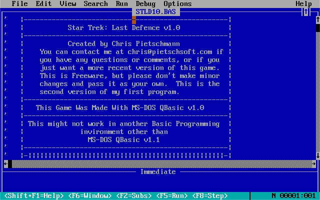

# Star Trek: Last Defence v1.0

This repository contains the source code for the text-based game titled "Star Trek: Last Defence" written in QBasic by Chris Pietschmann some time around the year 1996.

[View Source Code](STLD10.BAS)

